# DevOps-EKS-Capstone
This project utilizes DevOps tools to automate deployments from Docker images, Kubernetes clusters, and send it to Amazon EKS.

Ideally, this project would had been deployed using Infrastructure as Code (IaC) but due to time constraints, most EC2 deployments were made manually, but screenshots are provided!

## Jenkins Setup
An EC2 instance was created manually, utilizing the minimum permissions in the IAM Role, and the ability to make SSH to the EC2 to manually install jenkins.

EC2 Configs:
- AMI: Ubuntu `18.04 LTS`
- Instace Type: `t2.micro`

Once the EC2 is running, run the following:
- `sudo apt-get update`
- `sudo apt-get upgrade`
- `sudo apt-get install default-jdk`
This last command installs Java, which is needed to run Jenkins
Then, as directed in the [official docs](https://www.jenkins.io/doc/book/installing/#debianubuntu):
- `wget -q -O - https://pkg.jenkins.io/debian-stable/jenkins.io.key | sudo apt-key add -`
- `sudo sh -c 'echo deb https://pkg.jenkins.io/debian-stable binary/ > /etc/apt/sources.list.d/jenkins.list'`
- `sudo apt-get update`
- `sudo apt-get install jenkins`

To verify its running, do `sudo systemctl status jenkins`, and you should get an output like this
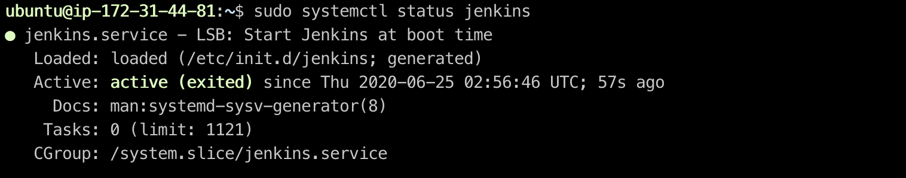

Access your serves using the DNS name as provided in AWS. Jenkins runs on port `8080`, visiting should look like this
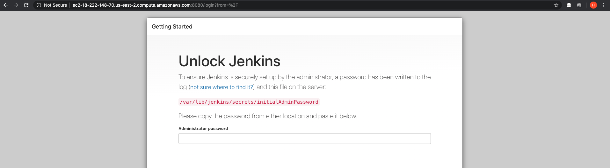

Install `Blue Ocean` and the `pipeline-aws`. Once you connect it to your github repo, you should have something like this:
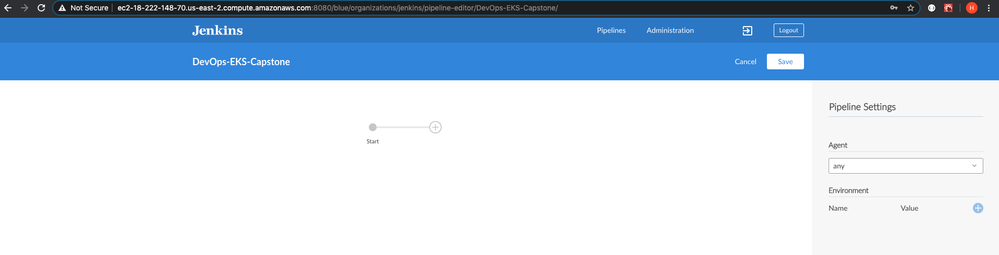

## Docker
Docker will be essential to be able to build the images, install docker on the Ubuntu EC2 by doing:
- `sudo apt-get update`
- `sudo apt install docker.io`
- `sudo systemctl start docker`
- `sudo systemctl enable docker`

Check that it was installed by doing:
- `docker --version`

## Hadolint
Hadolint is a Docker linter. Make a random mistake like incorrect alias name on the `Dockerfile`, then lets create a `Jenkins` file to start a Continous Intagration (CI) pipeline.
- Run `sudo usermod -a -G docker jenkins`

On `Dockerfile` change the `COPY --from=react-builder` to  `COPY --from=react-build` or something different. Then check Jenkins after pushing your changes to github.

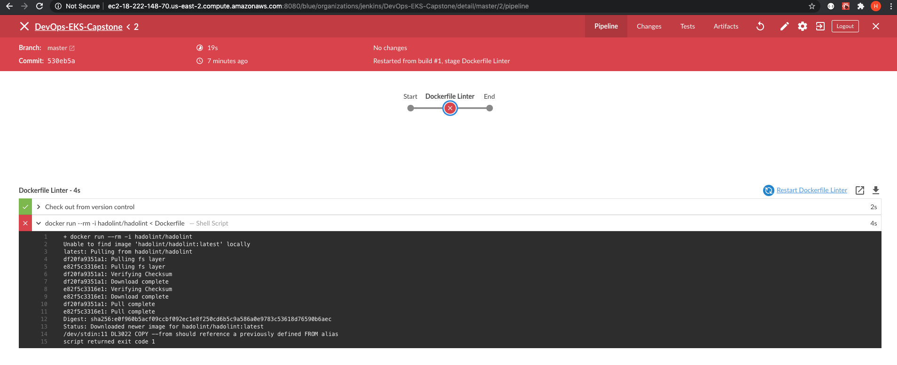

Now fix it to the way it was, and linter should pass.

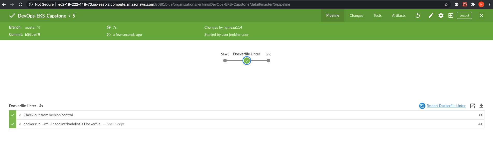

## Building the Dockerfile
Adding a new pipeline stage is pretty straight forward. Now lets add a stage to build the `Dockerfile` to then be pushed to the our docker account.

Configure the credentials on Jenkins, and have the reference to be `dockerhub`.

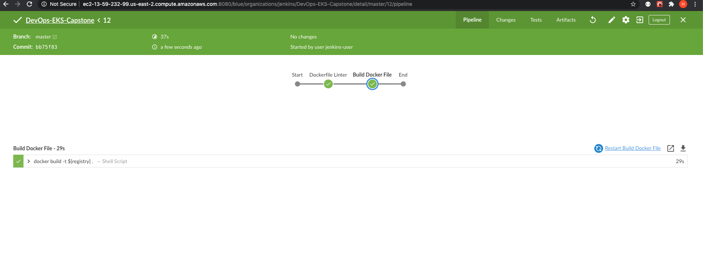

## Uploading to Dockerhub
Ideally, if you are working with images, it might be a better idea to store your images on AWS `Elastic Container Registry` to have everything within a single service. But for convenience, we are using Dockerhub.

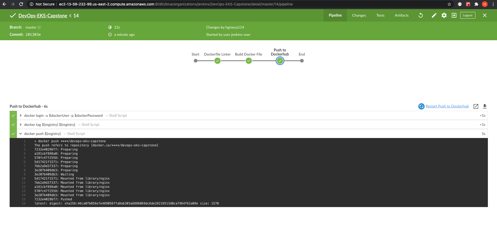

And tada! Its on the dockerhub repo!
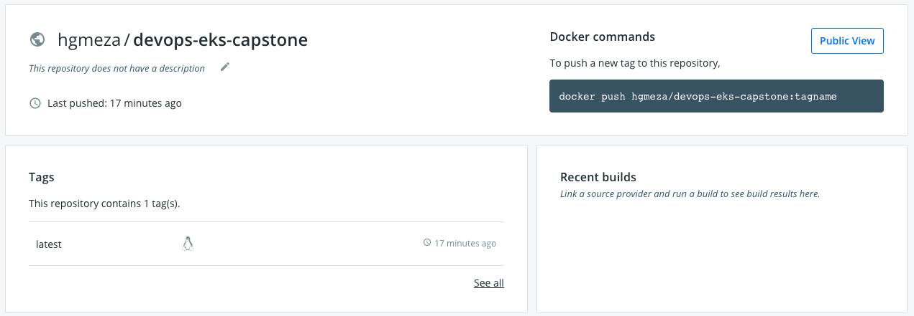

## Elastik Kubernetes Service (EKS)
Configure and deploy a new cluster using AWS EKS.

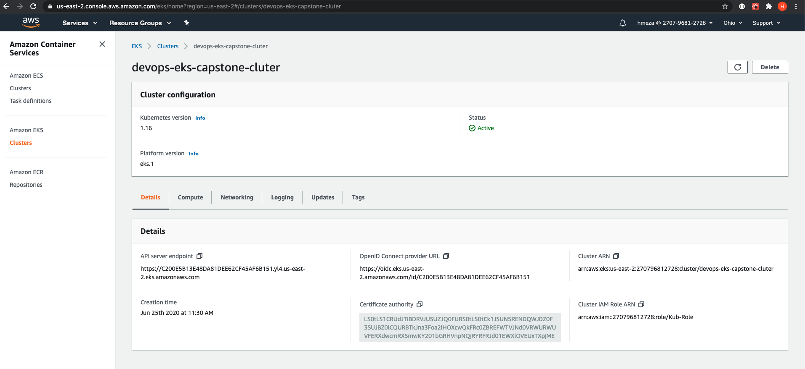

Container applications and microservices in general benefit from a Blue/Green deployment. So configuring those files are essential in Jenkins. The `./deployments` folder contains the required configurations for the Blue/Green deployment.

The new stages for givin context, deploy blue and green containers, creating the cluster service, user approval, and final deployments are made.

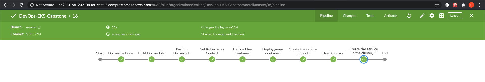

## Deployed App
Finally, accessing the DNS from Load Balancer, we have access to the client!

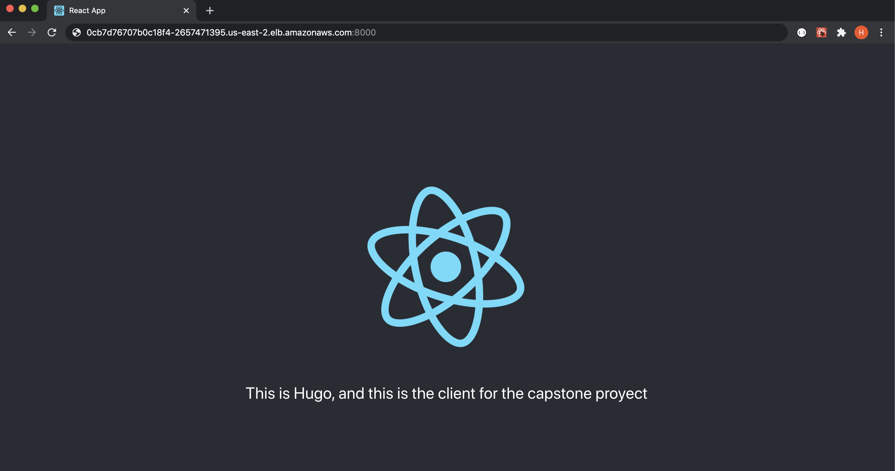